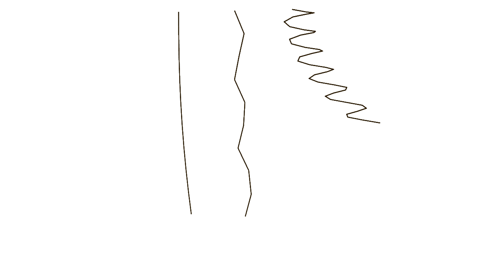

# PBD for Houdini

This project implements position-based dynamics in Houdini as custom SOP nodes written in C++. Please note that this is a work in progress.



## Features

Constraint Types:
- Distance
- Attachment
- Collision
- Bend-Twist (Rod)
- Stretch-Shear (Rod)

Position Based Dynamics Algorithm:
- Integration step
- Constraint projection step
- Update step
- Velocity solve step

## Compliation

### Prerequisites

This project is integrated with [SideFX Houdini](https://www.sidefx.com/) and requires an installation of Houdini and an active Houdini license to build and run.

This project depends on the following external libraries:
- [Houdini](https://www.sidefx.com/download/)
- [Eigen](https://libeigen.gitlab.io/)

Resources from [`Catch2`](https://github.com/catchorg/Catch2/tree/v2.x) and the [`PositionBasedDynamics`](https://github.com/InteractiveComputerGraphics/PositionBasedDynamics) library from InteractiveGraphics are included in the `extern` directory exclusively for testing purposes.


### Build Instructions

Once Houdini is installed, [initialize the Houdini environment](https://www.sidefx.com/faq/question/how-do-i-set-up-the-houdini-environment-for-command-line-tools/).

Navigate to the project directory.

Create and navigate to a build directory.
```sh
mkdir build && cd build
```

From the build directory, run `cmake ..` to generate configuration files. Then, run `make` or `cmake --build .` to make the build.

```sh
cmake ..
cmake --build .
```

Note that a successful build will create and link the shared library in the `dso` folder for the active Houdini installation. This library may be called `SOP_PBD.so` (Linux), `SOP_PBD.dylib` (Mac), or `SOP_PBD.dll` (Windows), depending on your operating system.

Launch the Houdini application and the new operator nodes will be available.

## Nodes

This project creates several custom nodes for creating constraints and running PBD simulation. All of the following are available within the SOP context when the library is installed (see [Compliation](#compliation)).

### Constraint Creation Nodes

- **Create Attachment Constraints**
- **Create Collision Constraints**
- **Create Distance Constraints**
- **Create Rod Constraints**

### Position-based Dynamics Simulation Nodes
- **PBD Integrate**
- **PBD Project Constraints**
- **PBD Apply Updates**
- **PBD Solve Velocity**

### Utility Nodes
- **Rod IO**
- **Orientation**

## Examples
For an example of using the PBD nodes in Houdini, see [Examples](./docs/Example_README.md).

## Resources
- [Houdini HDK](https://www.sidefx.com/docs/hdk/)
- [Position Based Dynamics Library | Interactive Computer Graphics](https://github.com/InteractiveComputerGraphics/PositionBasedDynamics)
- Matthias Müller, Bruno Heidelberger, Marcus Hennix, and John Ratcliff. [Position based dynamics](https://doi.org/10.1016/j.jvcir.2007.01.005). *Journal of Visual Communication and Image Representation*, 18(2):109–118, 2007.
- Miles Macklin, Matthias Müller, and Nuttapong Chentanez. [XPBD: position-based simulation of compliant constrained dynamics](https://dl.acm.org/doi/abs/10.1145/2994258.2994272). In *Proceedings of the 9th International Conference on Motion in Games*, MIG ’16, page 49–54, New York, NY, USA, 2016. Association for Computing Machinery.
- Tassilo Kugelstadt and Elmar Schömer. [Position and orientation based cosserat rods](https://doi.org/10.2312/sca.20161234). In *Symposium on Computer Animation*, volume 11, pages 169–178, 2016.