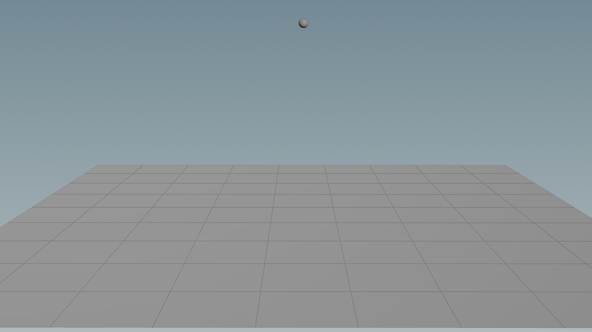

# PBD for Houdini Examples

## Hair Example

Hairs represented as rods with different rest and initial positions.

Constraints:
- Attachment constraints for gluing the root of the hair in place
- Bend/Twist constraints
- Stretch/Shear constraints

## Bouncing Ball Example

Initial values:
| Property | Details | Type | Value |
| -- | -- | -- | -- |
| `P` | Position | vector | (0, 1, 0) |
| `v` | Initial Velocity | vector | (0.1, 0, 0) |
| `mass` | Mass | Float | 0.5 |
| `restitution_e` | Restitution Coefficient | Float | 0.8 |
| `gravity` | Gravity | vector | (0, -9.81, 0) |

Constraints:
- Collision Constraints created on each substep
